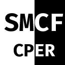

# 

##  SMCFcper

*SMCFcper* 是 *SMCFCompiler* 的缩写, 即 *SMCF 编译器*

### 📰 公告

**编译姬将迎来全新的改进，包括全新的ui、更快的速度、更好的性能等等 还请各位持续关注 [RE:SMCFcper](https://github.com/FreeDayO/re_cper)**

---

## 📂 如何使用

### [📲 示例站点](https://smcfcper.off.gs/)

### 💾 部署本地

1. `git clone git@github.com:FreeDayO/smcfcper.git`或者下载[发行页](https://github.com/FreeDayO/smcfcper/releases)中的源代码包并解压
2. `cd smcfcper`
3. 运行你的本地服务器软件
4. 访问对应页面

---

## 💖 感谢

SMCFcper 编译姬的诞生离不开这些项目:

0. 排名不分前后

1. [FreeDayO/smcf.js](https://github.com/FreeDayO/smcf.js)
2. [tonsky/FiraCode](https://github.com/tonsky/FiraCode)
3. [FortAwesome/Font-Awesome](https://github.com/FortAwesome/Font-Awesome)
4. [highlightjs/highlight.js](https://github.com/highlightjs/highlight.js)
5. [jquery/jquery](https://github.com/jquery/jquery)
6. [XeroAlpha/caidlist](https://github.com/XeroAlpha/caidlist)
7. [Stuk/jszip](https://github.com/Stuk/jszip)

---

## 💦 贡献者

---

## 📄 协议

`待添加`

---
